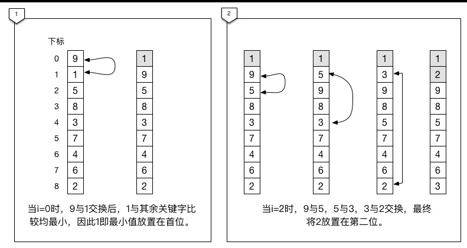
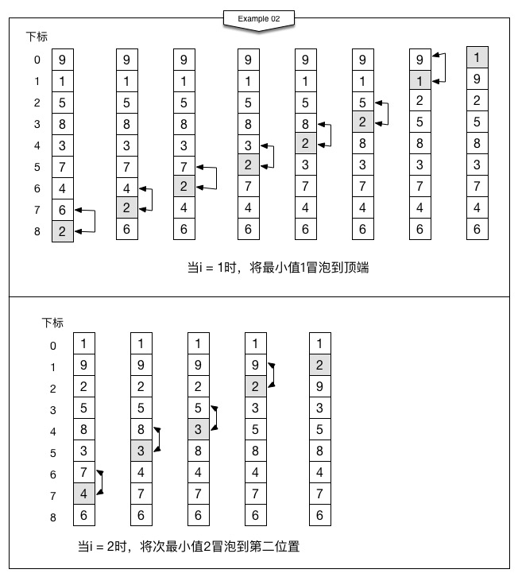

# 冒泡排序

> 冒泡排序是一种交换排序，它的基本思路：两两比较相邻的关键字，如果反序则交换，直到没有反序的记录为止。

### Example 01



```C

// 最原始的写法
void example_01(int *nums, int length)
{
    for (int i = 0; i<length-1; i++)
    {
        for (int j=i+1; j<length; j++)
        {
            if (nums[i] > nums[j])
            {
                int temp = nums[i];
                nums[i] = nums[j];
                nums[j] = temp;
            }
        }
    }
}
```

不是标准的冒泡排序算法，只是一个最简单的交换排序而已。

### Example 02



```C
// 优化了一点
void example_02(int *nums, int length)
{
    for (int i=0; i<length-1; i++)
    {
        for (int j=length-2; j>=i; j--)
        {
            if (nums[j]>nums[j+1])
            {
                int temp = nums[j];
                nums[j] = nums[j+1];
                nums[j+1] = temp;
            }
        }
    }
}
```

这是算是一个冒泡算法，但是效率不高。

### Example 03


```C
// 最终版
void example_03(int *nums, int length)
{
    int flag = 1;
    
    for (int i=0; (i<length-1) && flag; i++)
    {
        flag = 0;
        for (int j=length-2; j>=i; j--)
        {
            if (nums[j]>nums[j+1])
            {
                int temp = nums[j];
                nums[j] = nums[j+1];
                nums[j+1] = temp;
            }
            
            flag = 1;
        }
    }
}
```

当i = 2时，由于没有任何数据交换，就说明此序列已经有序， 之后的循环判断都是多月的。

这个是性能比较高的冒泡算法，能够避免正序时还需要继续遍历判断是否需要交换的不必要麻烦。

完整代码在[这里](./code/冒泡排序)

---

### 总结

当最好的情况下，也就是数组本身就是有序的，那么比较次数为`n-1`次。时间复杂度为`O(n)`.

当最坏的情况下，也就是数组是逆序的，此时需要比较：`n(n-1)/2`
 并作等数量级的记录移动。
 
 因此总的时间复杂度为`O(n^2)`