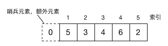

# 直接插入排序

> 直接插入排序的基本操作是将一个记录插入到已经排序好的有序表中，从而得到一个新的、记录数增1的有序表。

### Example



```Objective-C
// 其中nums[0]是额外的元素，真正需要排序的数组元素索引从"1"开始
void example_01(int *nums, int length)
{
    for (int i=2; i<length; i++)
    {
        if (nums[i] < nums[i-1])
        {
            nums[0] = nums[i];
            int j;
            for (j = i-1; nums[j]>nums[0]; j--)
            {
                nums[j+1] = nums[j];
            }
            
            nums[j+1] = nums[0];
        }
    }
}

```

### 总结

直接插入排序的时间复杂度为O(n^2)，同样的时间复杂度，**比[冒泡排序](./冒泡排序.md)和[简单选择排序](./简单选择排序.md)的性能要好一些。**