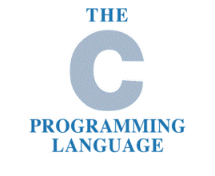

# C语言复习



## 指针

**所有的指针变量只占8个子节(32位系统占4字节）  用第一个字节的地址表示整个变量的地址**
```C

int main(void)
{
    double *p;
    double x = 66.6;
    
    p = &x; // x占8个字节，1个字节是8位，1个字节一个地址
    
    double arr[3] = {1.1, 2.2, 3.3};
    double *q;
    
    q = &arr[0];
    printf("%p\n", q); // %p实际就是以十六进制输出
    q = &arr[1];
    printf("%p\n", q);
    
    return 0;
}

```


**如何通过函数修改实参的值**
```C
void f(int *i)
{
    *i = 9;
}

int main(void) 
{
    int i = 0;
    f(&i);
    printf("i = %d", i);
    return 0;
}
```

**如何通过函数修改指针的值**
```C
void f(int **q)
{
    *q = (int *)0xFFFFFFFF;
}

int main(void)
{
    int i = 9;
    int *p = &i;
    printf("%p\n", p);
    f(&p);
    printf("%p\n", p);
    return 0;
}
```

## 结构体

> **为什么出现结构体？**
> 
> 为了表示一些复杂的数据，而普通的基本类型变量无法满足要求。

> **什么叫结构体？**
> 
> 结构体是用户根据实际需要自己定义的符合数据类型。

> **如何使用结构体？**
>
> struct Student st = {1000, "zhangsan", 20};
>
> struct Student *pst = &st;
>
> 1. st.sid
>
> 2. pst->sid (pst所指向的结构体变量中的sid这个成员)

> **主要事项**
> 
> 结构体变量不能加减乘除，但可以互相赋值
> 
> 普通结构体变量和结构体指针变量作为函数参数传参


例一：

```C
// 定义一个结构体（struct Student）
struct Student
{
    int sid;
    char name[200];
    int age;
};

int main(void)
{
    struct Student st = {1000, "zhangsan", 20};
    printf("%d %s %d\n", st.sid, st.name, st.age);
    
    st.sid = 99;
    strcpy(st.name, "lisi"); // 字符串不能直接赋值，只能通过该函数赋值
    st.age = 22;
    
    printf("%d %s %d\n", st.sid, st.name, st.age);
    return 0;
}
```

例二：

```C
// 定义一个结构体（struct Student）
struct Student
{
    int sid;
    char name[200];
    int age;
};

int main(void)
{
    struct Student st = {1000, "zhangsan", 20};
    // st.sid = 99; // 第一种方式
    
    struct Student *pst;
    pst = &st;
    pst->sid = 99; // pst->sid 等价于(*pst).sid即st.sid
}

```

例三：

```C
struct Student
{
    int sid;
    char name[200];
    int age;
};

void f(struct Student *pst);
void g(struct Student *st);

int main(void)
{
    struct Student st;
    f(&st);
    // printf("%d %s %d\n", st.sid, st.name, st.age);
    g(&st); // 输出打印
    
    return 0;
}

// void g(struct Student st);  不能这样写，浪费内存

// 用指针的方式传参，才对。
void g(struct Student *st)
{
    printf("%d %s %d\n", st->sid, st->name, st->age);
}

void f(struct Student *pst)
{
    (*pst).sid = 99;
    strcpy(pst->name, "zhangsan");
    pst->age = 22;
}
```

## 动态内存分配

```C
int main(void)
{
    // 这个int数组是静态分配内存，运行时不能更改数组长度大小
    int a[5] = {4, 10, 2, 8, 6};
    
    int len;
    printf("请输入你需要分配的数组的长度：len = ");
    
    scanf("%d", len); // 接收一个用户输入的长度
    
    // 动态分配len个int的内存
    int *pArr = (int *)malloc(sizeof(int) * len);
    
    *pArr = 4; // 类似于a[0] = 4
    pArr[1] = 10; // 类似于a[1] = 10
    
    // 我们可以把pArr当作一个普通数组来使用
    for(int i = 0; i<len; i++)
    {
        scanf("%d", &pArr[i]);
    }
    
    for(int i = 0; i<len; i++)
    {
        printf("%d\n", pArr[i]);
    }
    
    free(pArr); // 释放内存
    
    return 0;
}
```

*注意：只要没有使用`malloc()`分配的内存都是静态分配的内存。*


## 跨函数使用内存

```C
#include <stdio.h>
#include <string.h>
#include <stdlib.h>

struct Student
{
    int sid;
    int age;
};

struct Student *CreateStudent(void); // 创建
void ShowStudent(struct Student *ps); // 显示

int main(void)
{
    struct Student *ps = NULL;
    ps = CreateStudent();
    ShowStudent(ps);
}

struct Student *CreateStudent(void)
{
    struct Student *p = (struct Student *)malloc(sizeof(struct Student));
    p->sid = 99;
    p->age = 88;
    return p;
}

void ShowStudent(struct Student *ps)
{
    printf("sid = %d, age = %d\n", ps->sid, ps->age);
}
```

*注意：在函数体内声明的非`malloc()`分配的变量，会在函数结束后销毁，所以要想在函数结束后返回值仍然有效，需要分配在堆里面。*

## typedef的用法

没有用到`typedef`的`struct`的写法

```C
struct Student {
    int sid;
    char name[100];
    char gender;
};

int main(void)
{
    struct Student st;
    struct Student *ps = &st;
    
    return 0;
}
```

使用`typedef`后，`struct`的写法

Example 1:

```C
typedef struct {
    int sid;
    char name[100];
    char gender;
} Student;

int main(void)
{
    Student st;
    Student *ps = &st;
    
    return 0;
}
```

Example 2:

```C
typedef struct Student {
    int sid;
    char name[100];
    char gender;
}* PST; // PST等价于 struct Student *

int main(void)
{
    struct Student st;
    PST ps = &st;
    
    return 0;
}
```

Example 3:

```C
typedef struct Student
{
    int sid;
    char name[100];
    char gender;
}* PST, ST; // 等价于 ST代表了 struct Student, PST代表 struct Student *
```

