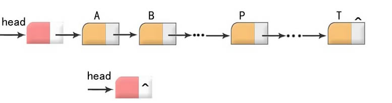

## 离散储存［链表］



### 定义：

1. N个节点离散分配
1. 彼此通过指针相连
1. 每个节点只有一个前驱节点，每个节点只有一个后续节点。
1. 首节点没有前驱节点，尾节点没有后续节点。


### 专业术语：

- **首节点**：第一个有效节点
- **尾节点**：最后一个有效节点
- **头结点**：第一个有效节点之前的节点，`头节点并不存放有效数据`。加头结点的目的主要是为了`方便对链表的操作`。
- **头指针**：指向`头结点`的指针变量
- **尾指针**：指向`尾结点`的指针变量


问：如果希望通过一个函数来对链表进行处理，我们至少需要接受链表得哪个参数？

答：只需要一个参数，**头指针**。
因为我们通过头指针可以推算出链表得其他所有信息。

Example 1:

```C

#include <stdio.h>
#include <stdlib.h>

// 声明一个非循环单链表
typedef struct Node {
    int data;
    struct Node *pNext;
} NODE, *PNODE;

// 创建一个非循环单链表，并返回
PNODE create_list(void);

// 遍历链表
void traverse_list(PNODE pHead);

// 判断链表是否为空
int is_empty(PNODE pHead);

// 计算链表的长度
int length_list(PNODE pHead);

// 在pHead所指向链表的第pos个节点的前面插入一个新的节点，该节点的值是val
int insert_list(PNODE pHead, int pos, int val);

// 删除
int delete_list(PNODE pHead, int pos);

// 从小到大排序
void sort_list(PNODE pHead);

int main(void)
{
    PNODE pHead = NULL;
    pHead = create_list();
    traverse_list(pHead);
    if (is_empty(pHead)) {
        printf("链表为空。\n");
    }
    
    printf("链表长度为：%d\n", length_list(pHead));
    
    sort_list(pHead);
    traverse_list(pHead);
    
    insert_list(pHead, 2, 11);
    traverse_list(pHead);
    
    delete_list(pHead, 1);
    traverse_list(pHead);
    
    return 0;
}

PNODE create_list(void)
{
    int len = 0;
    int val = 0;
    
    PNODE pHead = (PNODE)malloc(sizeof(NODE));
    if (NULL == pHead) {
        printf("分配失败，程序终止！\n");
        exit(-1);
    }
    
    PNODE pTail = pHead;
    pTail->pNext = NULL;
    
    printf("请输入您需要生成的链表节点的个数：len =");
    scanf("%d", &len);
    
    for (int i = 0; i<len; i++) {
        printf("请输入第%d个节点的值：", i + 1);
        scanf("%d", &val);
        
        PNODE pNew = (PNODE)malloc(sizeof(NODE));
        
        if (NULL == pNew) {
            printf("分配失败，程序终止！\n");
            exit(-1);
        }
        
        pNew->data = val;
        pNew->pNext = NULL;
        pTail->pNext = pNew;
        pTail = pNew;
    }
    
    return pHead;
};

void traverse_list(PNODE pHead)
{
    PNODE p = pHead->pNext;
    while (NULL != p) {
        printf("%d\t", p->data);
        p = p->pNext;
    }
    printf("\n");
}

int is_empty(PNODE pHead)
{
    if (NULL == pHead->pNext) {
        return 1;
    } else {
        return 0;
    }
}

int length_list(PNODE pHead)
{
    PNODE p = pHead->pNext;
    int cnt = 0;
    while (NULL != p) {
        cnt ++;
        p = p->pNext;
    }
    
    return cnt;
}

void sort_list(PNODE pHead)
{
    int len = length_list(pHead);
    int i, j, t;
    PNODE p, q;
    for (i = 0, p = pHead->pNext; i<len-1; i++, p = p->pNext) {
        for (j=i+1, q=p->pNext; j<len; j++, q=q->pNext) {
            if (p->data > q->data) {
                t = p->data;
                p->data = q->data;
                q->data = t;
            }
        }
    }
}

int insert_list(PNODE pHead, int pos, int val)
{
    if (is_empty(pHead)) {
        printf("链表为空\n");
        exit(-1);
    }
    
    if (pos > length_list(pHead)) {
        printf("超出链表索引！\n");
        exit(-1);
    }
    
    PNODE pNew = (PNODE)malloc(sizeof(NODE));
    
    if (NULL == pNew) {
        printf("动态分配内存失败！\n");
        exit(-1);
    }
    
    PNODE p = pHead->pNext;
    int i = 0;
    while (NULL != p && i < pos) {
        p = p->pNext;
        i ++;
    }
    
    PNODE q = p->pNext;
    pNew->pNext = q;
    
    p->pNext = pNew;
    pNew->data = val;
    
    return 1;
}

int delete_list(PNODE pHead, int pos)
{
    if (is_empty(pHead)) {
        printf("链表为空\n");
        exit(-1);
    }
    
    if (pos > length_list(pHead)) {
        printf("超出链表索引！\n");
        exit(-1);
    }
    
    PNODE p = pHead->pNext;
    PNODE prv = p;
    
    int i = 0;
    while (NULL != p) {
        if (i==pos) {
            break;
        }
        i++;
        prv = p;
        p = p->pNext;
    }
    
    prv->pNext = p->pNext;
    
    return p->data;
}

```

项目Demo在文件夹"[code_node](./code_node)"内