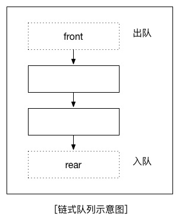
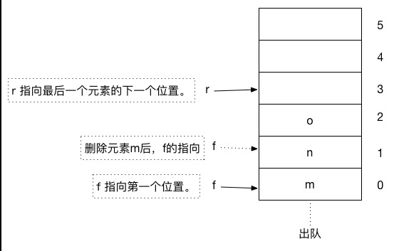

# 队列

## 定义

    一种可以实现“先进先出”的存储结构。
    
## 分类

1. 链式队列 *（用链表实现）*

    

1. 静态队列 *（用数组实现）*

    

    静态队列通常都必须是**循环队列**

    循环队列的讲解：
    
    1. 静态队列为什么必须是循环队列
    
        减少空间的浪费
        
    2. 循环队列需要几个参数来确定
    
        需要*两个参数*来确定：
        1. front
        1. rear
        
    3. 循环队列各个参数的含义
    
        2个参数不同场合有不同的含义
        
        1. 队列初始化：front和rear的值都是零。
        
        1. 队列非空：front代表的是队列的第一个元素，rear代表的是队列的最后一个有效元素的下一个元素。
        
        1. 队列为空：front和rear的值相等，但不定是零
    4. 循环队列入队伪算法讲解
    
        1. 将值传入r所代表的位置
        
        1. r = (r + 1) % 数组的长度
        
    5. 循环队列出队伪算法讲解
    
        f = (f + 1) % 数组的长度
    
    6. 如何判断循环队列是否为空
    
        f == r的时候循环队列为空
    
    7. 如何判断循环队列是否已满
        
        1. 多增加一个标识参数
        1. 少用一个元素［通常使用第这种方法］
        
        ```
        // 伪算法
        if( (r+1)%数组的长度 == f )
            已满
        else
            未满
        ```
        
## 队列算法

1. 入队
    ```C
    
    int en_queue(Queue *q, int val)
    {
        if (is_full(q)) {
            return 0;
        } else {
            q->pBase[q->rear] = val;
            
            // 入队，rear加1
            q->rear = (q->rear + 1) % kQueue_len;
            
            return 1;
        }
    }

    ```
1. 出队
    
    ```C
    int out_queue(Queue *q, int *pVal)
    {
        if (is_empty_queue(q)) {
            return 0;
        }
        
        *pVal = q->pBase[q->front];
        
        // 出队，front加1
        q->front = (q->front + 1)  % kQueue_len;
        
        return 1;
    }
    ```

## 队列的具体应用

所有和时间有关的操作都有队列的影子

### Example 1

以下是一个循环队列的具体代码实现的例子：

```C

#include <stdio.h>
#include <stdlib.h>

// 定义队列的长度
static const int kQueue_len = 6;

// 定义队列的结构体
typedef struct Queue {
    int *pBase;
    int front;
    int rear;
} Queue;

// 初始化
void init(Queue *, int);

// 入队
int en_queue(Queue *, int);

// 出队
int out_queue(Queue *, int *);

// 遍历
void traverse_queue(Queue *);

// 判断队列是否已满
int is_full(Queue *);

// 判断队列是否为空
int is_empty_queue(Queue *q);

int main(void)
{
    Queue q = {0};
    init(&q, kQueue_len);
    en_queue(&q, 1);
    en_queue(&q, 2);
    en_queue(&q, 3);
    en_queue(&q, 4);
    en_queue(&q, 5);
    en_queue(&q, 6);
    en_queue(&q, 7);
    en_queue(&q, 8);
    traverse_queue(&q);
    
    int pVal;
    
    if (out_queue(&q, &pVal)) {
        printf("出队成功，队列出队元素是%d\n", pVal);
    } else {
        printf("出队失败！\n");
    }
    
    traverse_queue(&q);
    
    return 0;
}

void init(Queue *q, int len)
{
    q->pBase = (int *)malloc(sizeof(int) * len);
    q->front = 0;
    q->rear = 0;
}

int en_queue(Queue *q, int val)
{
    if (is_full(q)) {
        return 0;
    } else {
        q->pBase[q->rear] = val;
        
        // 入队，rear加1
        q->rear = (q->rear + 1) % kQueue_len;
        
        return 1;
    }
}

int out_queue(Queue *q, int *pVal)
{
    if (is_empty_queue(q)) {
        return 0;
    }
    
    *pVal = q->pBase[q->front];
    
    // 出队，front加1
    q->front = (q->front + 1)  % kQueue_len;
    
    return 1;
}

int is_full(Queue *q)
{
    // rear紧挨着front一个元素的之间距的时候，队列就满了
    if (((q->rear + 1) % kQueue_len) == q->front) {
        return 1;
    }
    
    return 0;
}

int is_empty_queue(Queue *q)
{
    // 只要front等于rear，队列就为空
    if (q->front == q->rear) {
        return 1;
    }
    return 0;
}

void traverse_queue(Queue *q)
{
    int i = q->front;
    
    while (i != q->rear) {
        printf("%d\t", q->pBase[i]);
        
        // front位置不断加1取余链表长度，等于rear的时候，遍历完毕
        i = (i+1) % kQueue_len;
    }
    
    printf("\n");
}

```

代码在文件夹[code_01](code_01)中