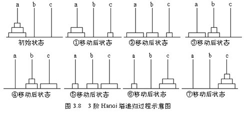

# 递归


定义：一个函数自己或间接调用自己
    
### 递归必须满足的三个条件

示例代码：

```C
// 递归求1加到n的和
int plus(int n)
{
    if (n == 1) {
        return 1;
    }
    
    return n+plus(n-1);
}
```

1. **递归必须有一个明确的终止条件**
    
    例如：
    ```C
    if (n == 1) {
        return 1;
    }
    ```

2. **该函数所处理得数据规模必须在递减**

    例如：
    ```C
    return n+plus(n-1);
    ```
    `plus(n-1)`始终在计算`n-1`的和，从而推断出更多的解。

3. **这个转化必须是可解得**

### 递归和循环的关系

- **递归**
    - 易于理解
    
        *用于“树”结构解析的时候很方便*

    - 速度慢
    
        *调用整个函数耗时长*
    
    - 存储空间大
    
        *每次调用函数都会开辟函数栈，存储空间线性增长。*
    
- **循环**
    - 不易理解
    - 速度块
    - 存储空间小
    
### 递归的应用

1. 树和森林就是以递归的方式定义的
2. 树和图的很多算法都是用递归实现的
3. 很多数学公式就是以递归的方式定义的
    - 菲拉波契序列
        1   2   3   5   8   13  21  34...

### Example 01

递归实现累加和阶乘：

```C

#include <stdio.h>

// 1加到n的递归
int plus(int n);
int _plus(int n);

// 求阶乘的递归
int factorial(int n);
int _factorial(int n);

int plus(int n)
{
    if (n == 1) {
        return 1;
    }
    
    return n+plus(n-1);
}

int _plus(int n)
{
    int val = 0;
    for (int i = 1; i<=100; i++) {
        val = val + i;
    }
    
    return val;
}

int factorial(int n)
{
    if (n == 1) {
        return 1;
    }
    
    return n * factorial(n-1);
}

int _factorial(int n)
{
    int val = 1;
    for (int i = 1; i<=n; i++) {
        val *= i;
    }
    return val;
}


```

### Example 02

**汉诺塔**算法的实现



```
// 伪算法
if(只有一个盘子)
{
    直接将A柱子上的盘子从A移到C
}
else
{
    先把A柱子上的前n-1个盘子从A借助C移到B
    将A柱子上的第n个盘子直接移到C
    再将B柱子上的n-1个盘子借助A移到C
}
```

代码实现：

```C
// 汉诺塔
void hannuota(int n, char A, char B, char C)
{
    if(1 == n) {
        printf("将编号为%d的盘子直接从%c柱子移到%c柱子\n", n, A, C);
    } else {
        hannuota(n-1, A, C, B);
        printf("将编号为%d的盘子直接从%c柱子移到%c柱子\n", n, A, C);
        hannuota(n-1, B, A, C);
    }
}

void main(void)
{
    char ch1 = 'A';
    char ch2 = 'B';
    char ch3 = 'C';
    int n;
    
    printf("请输入要移动盘子的个数：\n");
    scanf("%d", &n);
    hannuota(n, ch1, ch2, ch3);
    
    return 0;
}
```

输出：
```
请输入要移动盘子的个数：
3
将编号为1的盘子直接从A柱子移到C柱子
将编号为2的盘子直接从A柱子移到B柱子
将编号为1的盘子直接从C柱子移到B柱子
将编号为3的盘子直接从A柱子移到C柱子
将编号为1的盘子直接从B柱子移到A柱子
将编号为2的盘子直接从B柱子移到C柱子
将编号为1的盘子直接从A柱子移到C柱子
```

代码在[code_01](code_01)文件夹
