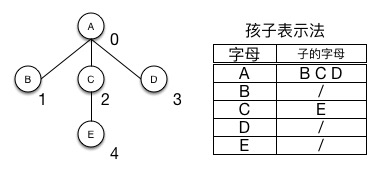
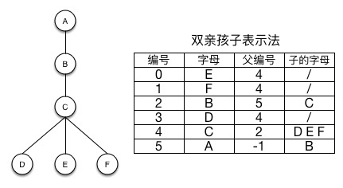
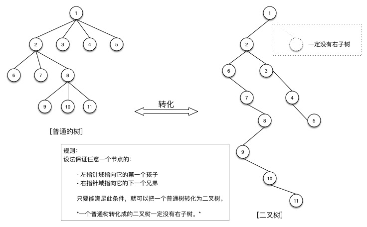
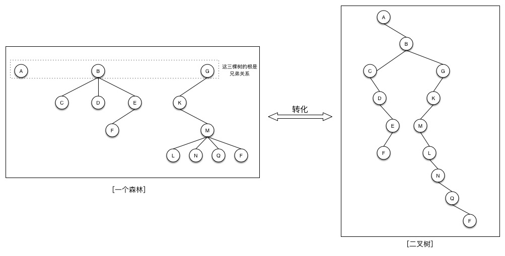

# 树


## 树的定义

- 专业定义：
    1. 有且只有一个称为根的节点。
    2. 有若干个互不相交的子树，这些子树本身也是一棵树。
-  通俗的定义：
    1. 树是由节点和边组成
    2. 每个节点只有一个父节点但可以有多个子节点
    3. 但有一个节点例外，该节点没有父节点，此节点称为根节点。

## 专业术语

```

节点    父节点  子节点
子孙    堂兄弟

深度：
    从根节点到最底层节点的层数称之为深度
    根节点是第一层
    
叶子节点：
    没有子节点的节点
    
非终端节点：
    实际就是非叶子节点
    
度：
    子节点的个数称为度
    
```

## 树的分类

1. **一般树**

    任意一个节点的子节点的个数都不受限制。

2. **二叉树**

    

    任意一个节点的子节点个数最多两个，且子节点的位置不可更改。 
    
    ***分类***
    
    1. 一般二叉树
    2. 满二叉树
    
    在不增加树的层数的前提下，无法再多添加一个节点的二叉树就是满二叉树。
    
    3. 完全二叉树
    
        如果只是删除了满二叉树最底层最右边的连续若干个节点，这样形成的二叉树就是完全二叉树。

3. **森林**

    n个互不相交的树的集合
    
## 树的存储

1. 二叉树的存储

    1. 连续储存［完全二叉树］
        - 优点：查找某个节点的父节点和子节点（也包括判断有没有子节点）速度很快
        - 缺点：耗用内存空间过大
    2. 链式存储
        - 优点：耗用内存空间小
    
2. 一般树的存储

    1. 双亲表示法
    
        
    
        求父节点方便,求子节点难。
    
    2. 孩子表示法
    
        
    
        求子节点方便，求父节点难。
    
    3. 双亲孩子表示法
    
        
    
        求父节点和子节点都很方便
    
    4. 二叉树表示法
    
        
    
        把一个普通树转化成二叉树来存储。
        
        具体转换方法：
        
        设法保证任意一个节点的：
            
        - 左指针域指向它的第一个孩子
        - 右指针域指向它的下一个兄弟
            
        只要能满足此条件，就可以把一个普通树转化为二叉树。
        
        *一个普通树转化成的二叉树一定没有右子树。*
        
3. 森林的存储

    

    先把森林转化成二叉树，再存储二叉树。
    
## 二叉树操作

