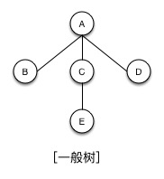

# 树


## 树的定义

- 专业定义：
    1. 有且只有一个称为根的节点。
    2. 有若干个互不相交的子树，这些子树本身也是一棵树。
-  通俗的定义：
    1. 树是由节点和边组成
    2. 每个节点只有一个父节点但可以有多个子节点
    3. 但有一个节点例外，该节点没有父节点，此节点称为根节点。

## 专业术语

```

节点    父节点  子节点
子孙    堂兄弟

深度：
    从根节点到最底层节点的层数称之为深度
    根节点是第一层
    
叶子节点：
    没有子节点的节点
    
非终端节点：
    实际就是非叶子节点
    
度：
    子节点的个数称为度
    
```

## 树的分类

1. **一般树**

    

    任意一个节点的子节点的个数都不受限制。

2. **二叉树**

    任意一个节点的子节点个数最多两个，且子节点的位置不可更改。 
    
    ***分类***
    
    1. 一般二叉树
    
    2. 满二叉树
    
    
    
    在不增加树的层数的前提下，无法再多添加一个节点的二叉树就是满二叉树。
    
    3. 完全二叉树
    
    
    
        如果只是删除了满二叉树最底层最右边的连续若干个节点，这样形成的二叉树就是完全二叉树。

3. **森林**

    

    n个互不相交的树的集合
    
## 树的存储

1. 二叉树的存储

    1. 连续储存［完全二叉树］
        - 优点：查找某个节点的父节点和子节点（也包括判断有没有子节点）速度很快
        - 缺点：耗用内存空间过大
    2. 链式存储
        - 优点：耗用内存空间小
    
2. 一般树的存储

    1. 双亲表示法
    
        
    
        求父节点方便,求子节点难。
    
    2. 孩子表示法
    
        
    
        求子节点方便，求父节点难。
    
    3. 双亲孩子表示法
    
        
    
        求父节点和子节点都很方便
    
    4. 二叉树表示法
    
        
    
        把一个普通树转化成二叉树来存储。
        
        具体转换方法：
        
        设法保证任意一个节点的：
            
        - 左指针域指向它的第一个孩子
        - 右指针域指向它的下一个兄弟
            
        只要能满足此条件，就可以把一个普通树转化为二叉树。
        
        *一个普通树转化成的二叉树一定没有右子树。*
        
3. 森林的存储

    

    先把森林转化成二叉树，再存储二叉树。
    
## 二叉树操作

### 遍历

1. 先序遍历*［先访问根节点］*

    

    1. 先访问根节点
    2. 再先序访问左子树
    3. 再先序访问右子树
    
2. 中序遍历*［中间访问根节点］*

    

    1. 中序遍历左子树
    2. 再访问根节点
    3. 再中序遍历右子树
    
3. 后序遍历*［最后访问根节点］*

    

    1. 中序遍历左子树
    2. 中序遍历右子树
    3. 再访问根节点

### 题目

**已知两种遍历序列求原始二叉树。**

> 通过先序和中序 或者 中序和后序，我们可以还原出原始的二叉树。
> 
> 但是通过先序和后序是无法还原出原始的二叉树的。
>
> 换种说法：
只有通过先序和中顺，或通过中序和后序，我们才可以唯一的确定一个二叉树。


## 应用

1. 树是数据库中数据组织的一种重要形式。
2. 操作系统子父进程的关系本身就是一棵树。
3. 面向对象语言中类的继承关系
4. 赫夫曼树

## Example


```C

#include <stdio.h>
#include <stdlib.h>

typedef struct BTNode {
    char data;
    struct BTNode *pLChild;
    struct BTNode *pRChild;
} BTNode;

// 根据上图创建一个二叉树
BTNode *CreateBTree(void);

// 先序输出二叉树
void preTraverseBTree(BTNode *);

// 中序输出二叉树
void midTraverseBTree(BTNode *);

// 后序输出二叉树
void afterTraverseBTree(BTNode *);

int main(int argc, const char * argv[]) {
    
    BTNode *pT = CreateBTree();
    
    // 调试
    preTraverseBTree(pT);
    midTraverseBTree(pT);
    afterTraverseBTree(pT);
    
    return 0;
}

BTNode *CreateBTree(void)
{
    BTNode *pA = (BTNode *)malloc(sizeof(BTNode));
    BTNode *pB = (BTNode *)malloc(sizeof(BTNode));
    BTNode *pC = (BTNode *)malloc(sizeof(BTNode));
    BTNode *pD = (BTNode *)malloc(sizeof(BTNode));
    BTNode *pE = (BTNode *)malloc(sizeof(BTNode));
    
    pA->data = 'A';
    pB->data = 'B';
    pC->data = 'C';
    pD->data = 'D';
    pE->data = 'E';
    
    pA->pLChild = pB;
    pA->pRChild = pC;
    pB->pLChild = pB->pRChild = NULL;
    pC->pLChild = pD;
    pC->pRChild = NULL;
    pD->pLChild = NULL;
    pD->pRChild = pE;
    pE->pLChild = pE->pRChild = NULL;
    
    return pA;
}

// 先序输出二叉树
void preTraverseBTree(BTNode *pT)
{
    /*
    1. 先访问根节点
    2. 再先序访问左子树
    3. 再先序访问右子树
     */
    if (pT) {
        printf("%c\n", pT->data);
        if (pT->pLChild) {
            preTraverseBTree(pT->pLChild);
        }
        
        if (pT->pRChild) {
            preTraverseBTree(pT->pRChild);
        }
    }
}

// 中序输出二叉树
void midTraverseBTree(BTNode *pT)
{
    /*
     1. 中序遍历左子树
     2. 再访问根节点
     3. 再中序遍历右子树
     */
    if (pT) {
        if (pT->pLChild) {
            midTraverseBTree(pT->pLChild);
        }
        
        printf("%c\n", pT->data);
        
        if (pT->pRChild) {
            midTraverseBTree(pT->pRChild);
        }
    }
}

// 后序输出二叉树
void afterTraverseBTree(BTNode *pT)
{
    /*
     1. 中序遍历左子树
     2. 中序遍历右子树
     3. 再访问根节点
     */
    if (pT) {
        if (pT->pLChild) {
            midTraverseBTree(pT->pLChild);
        }
        
        if (pT->pRChild) {
            midTraverseBTree(pT->pRChild);
        }
        
        printf("%c\n", pT->data);
    }
}


```